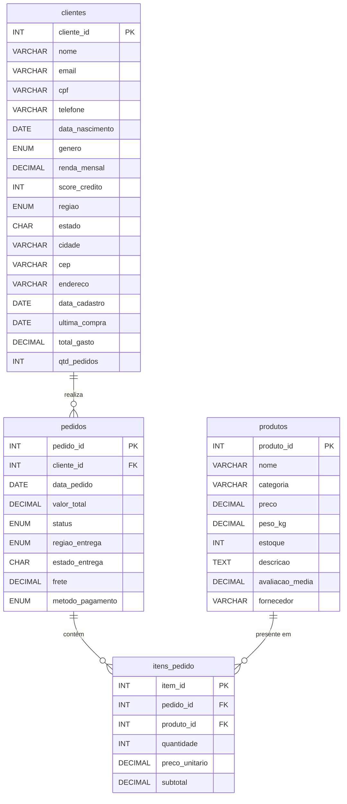

# Replicação e Fragmentação de Dados em Bancos Distribuídos

**Disciplina:** Infraestrutura para Big Data  
**Público:** Graduação em Ciência de Dados

---

## Objetivos de Aprendizagem

Ao final deste laboratório, você será capaz de:

- **Compreender a Arquitetura Replicada** de um cluster MySQL na AWS, com uma instância de escrita (Writer) e uma de leitura (Reader).
- **Conectar-se a Ambos os Endpoints** simultaneamente, simulando uma aplicação que lê e escreve ao mesmo tempo.
- **Carregar e Validar Dados**, garantindo a consistência entre as instâncias via replicação.
- **Testar e Comprovar a Replicação** de dados em tempo real.
- **Aplicar Fragmentação Horizontal**, dividindo linhas por critério geográfico e temporal.
- **Aplicar Fragmentação Vertical**, separando colunas por sensibilidade (LGPD) e frequência de acesso.
- **Aplicar Fragmentação Híbrida**, combinando ambas as estratégias.
- **Compreender os Casos de Uso** para replicação, sharding e fragmentação, e seus impactos em performance.

## Contexto do Cenário

Uma empresa de e-commerce opera em 3 regiões do Brasil (**Sul**, **Sudeste**, **Nordeste**). O volume de dados cresceu e a empresa precisa:

1. **Distribuir a carga de leitura** usando réplicas de leitura (Read Replicas), garantindo que consultas analíticas não sobrecarreguem a instância de escrita.
2. **Fragmentar os dados** entre nós regionais para otimizar consultas locais e atender requisitos de proteção de dados (LGPD).

---

## Arquitetura do Ambiente

O cluster **Aurora MySQL** na AWS possui dois endpoints distintos:

- **Endpoint de Gravação (Writer):** Centraliza todas as operações de escrita (`INSERT`, `UPDATE`, `DELETE`). Isso garante a consistência e a integridade dos dados.
- **Endpoint de Leitura (Reader):** Recebe uma cópia assíncrona dos dados do Writer. É usado para distribuir a carga de leitura (`SELECT`), permitindo atender mais usuários sem sobrecarregar a instância principal.

```
      [Sua Aplicação / DBeaver]
             |
             +-----> Operações de Escrita (INSERT, UPDATE, DELETE)
             |              |
             |              v
             |       [ENDPOINT DE GRAVAÇÃO]
             |         (Instância Writer)
             |              |
             |              | (Replicação automática)
             |              v
             +-----> Operações de Leitura (SELECT)
                            |
                            v
                     [ENDPOINT DE LEITURA]
                       (Instância Reader)
```

> **Importante:** Em um ambiente de produção, o balanceamento entre escrita e leitura é automático. Aqui, vamos simular esse comportamento usando duas conexões separadas no DBeaver.

---

## Pré-requisitos

| Item | Detalhes |
|------|----------|
| **Cluster Aurora MySQL** | Criado na AWS Academy sob orientação do professor |
| **DBeaver Community Edition** | Instalado na sua máquina local |
| **Endpoint de gravação** | Fornecido pelo professor (operações de escrita) |
| **Endpoint de leitura** | Fornecido pelo professor (operações de leitura) |
| **Usuário / Senha** | Conforme orientação do professor |
| **Script SQL** | Arquivo `criar_banco_ecommerce.sql` disponível neste repositório |
| **Estado inicial** | Nenhum banco de dados de usuário existe no cluster |

---

## Parte 1 — Conexão ao Cluster (Duas Sessões)

Vamos criar **duas conexões simultâneas** no DBeaver, simulando uma aplicação que separa escritas e leituras.

### Sessão A — Gravação (Writer)

1. Abra o **DBeaver Community Edition**.
2. Crie uma nova conexão MySQL:
   - **Nome da conexão:** `ECOMMERCE-WRITER`
   - **Host:** endpoint de **gravação** do cluster Aurora MySQL
   - **Porta:** `3306`
   - **Usuário / Senha:** conforme orientação do professor
3. Teste a conexão e confirme que está funcionando.

### Sessão B — Leitura (Reader)

4. Crie uma **segunda** conexão MySQL:
   - **Nome da conexão:** `ECOMMERCE-READER`
   - **Host:** endpoint de **leitura** do cluster Aurora MySQL
   - **Porta:** `3306`
   - **Usuário / Senha:** os mesmos da sessão A
5. Teste a conexão e confirme que está funcionando.

> **Mantenha as duas janelas de conexão abertas, lado a lado.** Todas as operações de escrita (`CREATE`, `INSERT`, `ALTER`, `DROP`) serão executadas na **Sessão A (Writer)**. As operações de leitura e verificação serão executadas na **Sessão B (Reader)** para comprovar a replicação.

---

## Parte 2 — Criação e Carga do Banco Centralizado

Nesta etapa você criará o banco de dados centralizado que servirá de base para todas as fragmentações. **Execute na Sessão A (Writer).**

### Modelo de Dados

O diagrama abaixo mostra as 4 tabelas do banco `ecommerce_central` e seus relacionamentos:



> **Observe a tabela `clientes`:** identifique quais colunas são *públicas* (nome, email, cidade...) e quais são *sensíveis* (CPF, renda, score). Isso será importante na fragmentação vertical.

### Tarefa 2.1 — Executar o script de criação e carga (Sessão A — Writer)

O arquivo **`criar_banco_ecommerce.sql`** contém todos os comandos necessários para criar o banco, as tabelas e inserir os dados de exemplo.

1. Na **Sessão A (Writer)** do DBeaver, abra o arquivo `criar_banco_ecommerce.sql` (menu **File → Open File**).
2. Execute o script inteiro: **Ctrl+A** (selecionar tudo) → **Ctrl+Enter** (executar).
3. Aguarde a conclusão. O banco `ecommerce_central` será criado com:
   - **4 tabelas:** `clientes`, `produtos`, `pedidos`, `itens_pedido`
   - **30 clientes** (10 por região: Sudeste, Sul, Nordeste)
   - **20 produtos**
   - **60 pedidos** (~20 por região)
   - **72 itens de pedido**

> **Atenção:** Este script deve ser executado **apenas na Sessão A (Writer)**. Operações de escrita enviadas ao endpoint de leitura serão rejeitadas pelo cluster.

---

## Parte 3 — Validação dos Dados e Teste da Replicação

Nesta etapa vamos confirmar que os dados foram carregados e comprovar que a **replicação** entre Writer e Reader está funcionando.

### Tarefa 3.1 — Visão geral do banco (Sessão A — Writer)

Execute a consulta abaixo na **Sessão A (Writer)** e anote os resultados:

```sql
USE ecommerce_central;

SELECT 'clientes'     AS tabela, COUNT(*) AS registros FROM clientes
UNION ALL
SELECT 'produtos',     COUNT(*) FROM produtos
UNION ALL
SELECT 'pedidos',      COUNT(*) FROM pedidos
UNION ALL
SELECT 'itens_pedido', COUNT(*) FROM itens_pedido;
```

> **Resultado esperado:** 30 clientes, 20 produtos, 60 pedidos, 72 itens.

### Tarefa 3.2 — Validação da Replicação (Sessão B — Reader)

Agora execute **exatamente a mesma consulta** na **Sessão B (Reader)**:

```sql
USE ecommerce_central;

SELECT 'clientes'     AS tabela, COUNT(*) AS registros FROM clientes
UNION ALL
SELECT 'produtos',     COUNT(*) FROM produtos
UNION ALL
SELECT 'pedidos',      COUNT(*) FROM pedidos
UNION ALL
SELECT 'itens_pedido', COUNT(*) FROM itens_pedido;
```

> **Os resultados devem ser idênticos aos da Sessão A!** Isso comprova que a replicação está funcionando — os dados inseridos no Writer foram automaticamente copiados para o Reader.

### Tarefa 3.3 — Distribuição por região (Sessão B — Reader)

Execute as consultas abaixo na **Sessão B (Reader)** para entender a distribuição dos dados:

```sql
SELECT regiao, COUNT(*) AS total_clientes
FROM clientes
GROUP BY regiao
ORDER BY total_clientes DESC;
```

```sql
SELECT regiao_entrega, COUNT(*) AS total_pedidos, 
       ROUND(SUM(valor_total),2) AS receita_total
FROM pedidos
GROUP BY regiao_entrega
ORDER BY receita_total DESC;
```

> **Reflexão:** A distribuição é equilibrada entre as regiões? Isso é importante para a fragmentação horizontal.

### Tarefa 3.4 — Teste de Replicação em Tempo Real

Vamos **inserir um novo registro** no Writer e verificar se ele aparece no Reader.

**Na Sessão A (Writer)**, insira um cliente temporário:

```sql
INSERT INTO clientes (nome, email, cpf, regiao, estado, cidade, data_cadastro)
VALUES ('Cliente Teste Replicação', 'teste@teste.com', '000.000.000-00',
        'Sudeste', 'SP', 'São Paulo', CURDATE());
```

**Imediatamente na Sessão B (Reader)**, tente buscar este registro:

```sql
SELECT cliente_id, nome, email, regiao 
FROM clientes 
WHERE nome = 'Cliente Teste Replicação';
```

> **Resultado:** É possível que a consulta não retorne nada no primeiro segundo. Execute-a novamente após 2-3 segundos. O novo registro aparecerá! Essa pequena demora é a **latência de replicação**.

### Tarefa 3.5 — Remover o registro de teste (Sessão A — Writer)

Limpe o registro temporário para não interferir nas próximas etapas:

```sql
DELETE FROM clientes WHERE nome = 'Cliente Teste Replicação';
```

> **Verifique na Sessão B (Reader):** Após alguns segundos, o registro também desaparecerá da réplica.

---

## Parte 4 — Fragmentação Horizontal

> **A partir desta parte, todos os comandos de criação de tabela (`CREATE TABLE`) e escrita devem ser executados na Sessão A (Writer).** Após a execução, você pode verificar na Sessão B (Reader) que as tabelas foram replicadas.

### Conceito

Dividir as **linhas** de uma tabela entre fragmentos com base em um critério (geralmente geográfico, temporal ou por faixa de valores). Cada fragmento possui o **mesmo esquema**, mas um **subconjunto das linhas**.

**Três regras fundamentais:**

| Regra | Descrição |
|-------|-----------|
| **Completude** | A união de todos os fragmentos = tabela original |
| **Disjunção** | A interseção entre fragmentos = vazio (sem duplicatas) |
| **Reconstrução** | `SELECT * FROM frag1 UNION ALL SELECT * FROM frag2 ...` reconstrói o original |

> **Analogia:** É como dividir uma lista telefônica por bairro. Cada bairro tem a mesma estrutura (nome, telefone, endereço), mas cada livro só contém os moradores daquele bairro.

### Tarefa 4.1 — Criar fragmentos horizontais da tabela `clientes` por região (Sessão A — Writer)

Simularemos 3 "nós regionais". Cada nó armazena apenas os clientes de sua região.

```sql
-- NÓ SUDESTE
CREATE TABLE clientes_sudeste AS
SELECT * FROM clientes WHERE regiao = 'Sudeste';

-- NÓ SUL
CREATE TABLE clientes_sul AS
SELECT * FROM clientes WHERE regiao = 'Sul';

-- NÓ NORDESTE
CREATE TABLE clientes_nordeste AS
SELECT * FROM clientes WHERE regiao = 'Nordeste';
```

### Tarefa 4.2 — Criar fragmentos horizontais da tabela `pedidos` por região (Sessão A — Writer)

```sql
CREATE TABLE pedidos_sudeste AS
SELECT * FROM pedidos WHERE regiao_entrega = 'Sudeste';

CREATE TABLE pedidos_sul AS
SELECT * FROM pedidos WHERE regiao_entrega = 'Sul';

CREATE TABLE pedidos_nordeste AS
SELECT * FROM pedidos WHERE regiao_entrega = 'Nordeste';
```

### Tarefa 4.3 — Verificar a contagem por fragmento (Sessão A — Writer)

```sql
SELECT 'clientes_sudeste'  AS fragmento, COUNT(*) AS registros FROM clientes_sudeste
UNION ALL
SELECT 'clientes_sul',      COUNT(*) FROM clientes_sul
UNION ALL
SELECT 'clientes_nordeste',  COUNT(*) FROM clientes_nordeste;
```

```sql
SELECT 'pedidos_sudeste'   AS fragmento, COUNT(*) AS registros FROM pedidos_sudeste
UNION ALL
SELECT 'pedidos_sul',       COUNT(*) FROM pedidos_sul
UNION ALL
SELECT 'pedidos_nordeste',   COUNT(*) FROM pedidos_nordeste;
```

> **Confira:** A soma dos fragmentos deve ser igual ao total da tabela original.

### Tarefa 4.4 — Verificar replicação dos fragmentos (Sessão B — Reader)

Execute na **Sessão B (Reader)** para comprovar que as tabelas fragmentadas também foram replicadas:

```sql
SELECT 'clientes_sudeste'  AS fragmento, COUNT(*) AS registros FROM clientes_sudeste
UNION ALL
SELECT 'clientes_sul',      COUNT(*) FROM clientes_sul
UNION ALL
SELECT 'clientes_nordeste',  COUNT(*) FROM clientes_nordeste;
```

> **Os resultados devem ser idênticos aos da Sessão A!** Isso mostra que operações DDL (`CREATE TABLE`) e DML (`INSERT`) no Writer são replicadas automaticamente para o Reader.

### Tarefa 4.5 — Verificar a regra de COMPLETUDE

```sql
SELECT COUNT(*) AS total_reconstruido
FROM (
    SELECT cliente_id FROM clientes_sudeste
    UNION ALL
    SELECT cliente_id FROM clientes_sul
    UNION ALL
    SELECT cliente_id FROM clientes_nordeste
) AS reconstrucao;
```

> **Compare** com `SELECT COUNT(*) FROM clientes;` — os valores devem ser iguais.

### Tarefa 4.6 — Verificar a regra de DISJUNÇÃO

```sql
SELECT COUNT(*) AS sobreposicao_sudeste_sul
FROM clientes_sudeste s1
INNER JOIN clientes_sul s2 ON s1.cliente_id = s2.cliente_id;
```

> **Resultado esperado:** 0 (zero). Não pode haver sobreposição entre fragmentos.

### Tarefa 4.7 — Executar uma consulta LOCAL (rápida)

Uma consulta que precisa de dados de apenas um nó:

```sql
-- "Qual o total de vendas no Sudeste?"
SELECT SUM(valor_total) AS receita_sudeste
FROM pedidos_sudeste;
```

> **Reflexão:** Em um sistema distribuído real, esta consulta seria rápida pois acessaria apenas o nó local.

### Tarefa 4.8 — Executar uma consulta DISTRIBUÍDA (custosa)

Uma consulta que requer dados de **todos** os nós:

```sql
-- "TOP 5 clientes por gasto total em TODAS as regiões"
SELECT nome, regiao, total_gasto
FROM (
    SELECT nome, regiao, total_gasto FROM clientes_sudeste
    UNION ALL
    SELECT nome, regiao, total_gasto FROM clientes_sul
    UNION ALL
    SELECT nome, regiao, total_gasto FROM clientes_nordeste
) AS todos_clientes
ORDER BY total_gasto DESC
LIMIT 5;
```

> **Reflexão:** Em um sistema distribuído real, esta consulta exigiria comunicação entre os 3 nós. Qual o impacto em performance?

---

## Parte 5 — Fragmentação Vertical

### Conceito

Dividir as **colunas** de uma tabela entre fragmentos. Cada fragmento contém a **chave primária** (para permitir reconstrução) + um subconjunto de colunas.

**Motivações comuns:**
- Separar dados públicos de dados sensíveis (**LGPD!**)
- Separar colunas acessadas frequentemente das raramente consultadas
- Otimizar cache: colunas "quentes" vs colunas "frias"

> **Regra:** Cada fragmento **deve** conter a chave primária.  
> **Reconstrução:** `JOIN` entre fragmentos pela chave primária.

> **Analogia:** É como dividir uma ficha cadastral em duas partes: uma com dados públicos (nome, cidade) e outra com dados confidenciais (CPF, renda), ambas ligadas pelo mesmo número de registro.

### Tarefa 5.1 — Criar fragmento de PERFIL PÚBLICO (Sessão A — Writer)

```sql
CREATE TABLE clientes_perfil_publico AS
SELECT 
    cliente_id,
    nome,
    email,
    genero,
    regiao,
    estado,
    cidade,
    data_cadastro,
    ultima_compra,
    total_gasto,
    qtd_pedidos
FROM clientes;
```

### Tarefa 5.2 — Criar fragmento de DADOS SENSÍVEIS (Sessão A — Writer)

```sql
CREATE TABLE clientes_dados_sensiveis AS
SELECT 
    cliente_id,
    cpf,
    telefone,
    data_nascimento,
    renda_mensal,
    score_credito
FROM clientes;
```

### Tarefa 5.3 — Criar fragmento de ENDEREÇO (Sessão A — Writer)

```sql
CREATE TABLE clientes_endereco AS
SELECT 
    cliente_id,
    cep,
    endereco,
    cidade,
    estado,
    regiao
FROM clientes;
```

### Tarefa 5.4 — Verificar a estrutura de cada fragmento

```sql
DESCRIBE clientes_perfil_publico;
DESCRIBE clientes_dados_sensiveis;
DESCRIBE clientes_endereco;
```

> **Observe:** Todos os fragmentos contêm `cliente_id` (a chave primária). Isso é obrigatório para permitir a reconstrução.

### Tarefa 5.5 — Reconstruir a tabela original via JOIN

```sql
SELECT 
    p.cliente_id,
    p.nome,
    p.email,
    s.cpf,
    s.telefone,
    s.data_nascimento,
    p.genero,
    s.renda_mensal,
    s.score_credito,
    p.regiao,
    e.estado,
    e.cidade,
    e.cep,
    e.endereco,
    p.data_cadastro,
    p.ultima_compra,
    p.total_gasto,
    p.qtd_pedidos
FROM clientes_perfil_publico p
JOIN clientes_dados_sensiveis s ON p.cliente_id = s.cliente_id
JOIN clientes_endereco e ON p.cliente_id = e.cliente_id
ORDER BY p.cliente_id;
```

> **Verifique:** O resultado deve ser idêntico a `SELECT * FROM clientes ORDER BY cliente_id;`

### Tarefa 5.6 — Consulta que usa SOMENTE o fragmento público (Sessão B — Reader)

```sql
-- "Ranking de clientes por quantidade de pedidos"
SELECT nome, cidade, estado, qtd_pedidos, total_gasto
FROM clientes_perfil_publico
ORDER BY qtd_pedidos DESC
LIMIT 10;
```

> **Reflexão:** Esta consulta é eficiente porque não precisa acessar os outros fragmentos.

### Tarefa 5.7 — Consulta que REQUER JOIN entre fragmentos (Sessão B — Reader)

```sql
-- "Clientes com renda acima de R$ 8.000 e mais de 5 pedidos"
SELECT 
    p.nome,
    p.cidade,
    s.renda_mensal,
    s.score_credito,
    p.qtd_pedidos,
    p.total_gasto
FROM clientes_perfil_publico p
JOIN clientes_dados_sensiveis s ON p.cliente_id = s.cliente_id
WHERE s.renda_mensal > 8000 AND p.qtd_pedidos > 5
ORDER BY s.renda_mensal DESC;
```

> **Reflexão:** Esta consulta é mais custosa pois requer dados de dois fragmentos diferentes. Em um sistema distribuído, isso significaria comunicação entre nós.

---

## Parte 6 — Fragmentação Híbrida (Horizontal + Vertical)

Na prática, ambas as estratégias são usadas em conjunto.

### Tarefa 6.1 — Fragmentar horizontalmente o perfil público por região (Sessão A — Writer)

Partimos do fragmento vertical `clientes_perfil_publico` (já criado) e aplicamos fragmentação horizontal:

```sql
CREATE TABLE perfil_publico_sudeste AS
SELECT * FROM clientes_perfil_publico WHERE regiao = 'Sudeste';

CREATE TABLE perfil_publico_sul AS
SELECT * FROM clientes_perfil_publico WHERE regiao = 'Sul';

CREATE TABLE perfil_publico_nordeste AS
SELECT * FROM clientes_perfil_publico WHERE regiao = 'Nordeste';
```

### Tarefa 6.2 — Verificar a fragmentação híbrida

```sql
SELECT 'perfil_publico_sudeste'  AS fragmento, COUNT(*) AS registros FROM perfil_publico_sudeste
UNION ALL
SELECT 'perfil_publico_sul',      COUNT(*) FROM perfil_publico_sul
UNION ALL
SELECT 'perfil_publico_nordeste',  COUNT(*) FROM perfil_publico_nordeste;
```

---

## Parte 7 — Fragmentação Horizontal por Faixa Temporal (Bônus)

Essa estratégia é muito comum em sistemas de Big Data (particionamento por data).

### Tarefa 7.1 — Criar fragmentos temporais da tabela `pedidos` (Sessão A — Writer)

```sql
CREATE TABLE pedidos_2024_s1 AS
SELECT * FROM pedidos WHERE data_pedido BETWEEN '2024-01-01' AND '2024-06-30';

CREATE TABLE pedidos_2024_s2 AS
SELECT * FROM pedidos WHERE data_pedido BETWEEN '2024-07-01' AND '2024-12-31';

CREATE TABLE pedidos_2025 AS
SELECT * FROM pedidos WHERE data_pedido >= '2025-01-01';
```

### Tarefa 7.2 — Verificar os fragmentos temporais

```sql
SELECT 'pedidos_2024_s1' AS fragmento, COUNT(*) AS registros, 
       MIN(data_pedido) AS inicio, MAX(data_pedido) AS fim FROM pedidos_2024_s1
UNION ALL
SELECT 'pedidos_2024_s2', COUNT(*), MIN(data_pedido), MAX(data_pedido) FROM pedidos_2024_s2
UNION ALL
SELECT 'pedidos_2025',    COUNT(*), MIN(data_pedido), MAX(data_pedido) FROM pedidos_2025;
```

> **Reflexão:** Se uma consulta precisa apenas de dados de 2025, ela acessaria apenas um fragmento em vez da tabela inteira.

---

## Parte 8 — Questões para Discussão

Depois de executar todos os comandos, discuta com seu grupo:

### Questão 8.1

**Qual fragmentação facilita esta consulta?**

```sql
-- "Total de vendas por região no último trimestre"
SELECT regiao_entrega, 
       COUNT(*) AS qtd_pedidos,
       ROUND(SUM(valor_total), 2) AS receita
FROM pedidos
WHERE data_pedido >= '2025-01-01'
GROUP BY regiao_entrega
ORDER BY receita DESC;
```

<details>
<summary>💡 Resposta</summary>

Fragmentação **horizontal por região** — cada nó calcula localmente e depois consolida.

</details>

### Questão 8.2

**E esta consulta, qual fragmentação prejudica?**

```sql
-- "Lista de clientes com score de crédito > 800 e seus pedidos"
SELECT 
    p.nome, p.email, p.regiao,
    s.score_credito, s.renda_mensal,
    p.total_gasto
FROM clientes_perfil_publico p
JOIN clientes_dados_sensiveis s ON p.cliente_id = s.cliente_id
WHERE s.score_credito > 800
ORDER BY s.score_credito DESC;
```

<details>
<summary>💡 Resposta</summary>

A fragmentação **vertical** prejudica, pois requer JOIN entre fragmentos — o `score_credito` está nos dados sensíveis enquanto o `nome` está no perfil público.

</details>

### Questão 8.3

**Como a LGPD se beneficia da fragmentação vertical?**

<details>
<summary>💡 Resposta</summary>

Dados sensíveis (CPF, renda, score) ficam em um fragmento separado com controle de acesso mais restrito. Isso permite auditar e proteger dados pessoais de forma granular. Por exemplo, um analista de marketing pode ter acesso apenas ao fragmento público, sem nunca visualizar dados pessoais.

</details>

### Questão 8.4

**Qual é o custo de uma consulta global em fragmentação horizontal?**

Execute e compare:

```sql
SELECT 
    'Consulta centralizada' AS tipo,
    ROUND(AVG(total_gasto), 2) AS media_gasto
FROM clientes

UNION ALL

SELECT 
    'Consulta distribuída (UNION ALL)' AS tipo,
    ROUND(AVG(total_gasto), 2) AS media_gasto
FROM (
    SELECT total_gasto FROM clientes_sudeste
    UNION ALL
    SELECT total_gasto FROM clientes_sul
    UNION ALL
    SELECT total_gasto FROM clientes_nordeste
) AS todos;
```

> **Ambas devem retornar o mesmo valor!** A diferença seria o custo de rede em um sistema distribuído real.

### Questão 8.5

**Quando a replicação (ter cópias de leitura) é mais indicada que o sharding (dividir os dados entre vários bancos)?**

<details>
<summary>💡 Resposta</summary>

A **replicação** é mais indicada quando o sistema tem uma carga de leitura muito superior à escrita (ex.: catálogo de e-commerce com muitas consultas de produtos e poucos cadastros). Ela permite escalar as leituras adicionando mais réplicas. O **sharding** é mais adequado quando o volume total de dados ou a carga de escrita ultrapassa a capacidade de um único servidor — por exemplo, bilhões de registros de transações que precisam ser divididos por região ou faixa de valores.

</details>

### Questão 8.6

**Você observou que as tabelas criadas no Writer (via `CREATE TABLE ... AS SELECT`) apareceram automaticamente no Reader. Em um cenário de sharding real, isso aconteceria? Qual a diferença?**

<details>
<summary>💡 Resposta</summary>

Não. Em um cluster **replicado** (como o que usamos), todas as operações DDL e DML do Writer são replicadas automaticamente para o Reader — ambos possuem os mesmos dados. Em um cenário de **sharding** real, cada nó teria um subconjunto dos dados e as tabelas precisariam ser criadas explicitamente em cada nó. A replicação garante **alta disponibilidade** e **escalabilidade de leitura**, enquanto o sharding garante **escalabilidade de escrita** e **capacidade de armazenamento**.

</details>

---

## Resumo das Tabelas Criadas

| Categoria | Tabelas |
|-----------|---------|
| **Banco centralizado** | `clientes`, `produtos`, `pedidos`, `itens_pedido` |
| **Frag. horizontal (região)** | `clientes_sudeste`, `clientes_sul`, `clientes_nordeste`, `pedidos_sudeste`, `pedidos_sul`, `pedidos_nordeste` |
| **Frag. horizontal (período)** | `pedidos_2024_s1`, `pedidos_2024_s2`, `pedidos_2025` |
| **Frag. vertical** | `clientes_perfil_publico`, `clientes_dados_sensiveis`, `clientes_endereco` |
| **Frag. híbrida** | `perfil_publico_sudeste`, `perfil_publico_sul`, `perfil_publico_nordeste` |

---

## Conceitos-Chave Aprendidos

| Conceito | Descrição |
|----------|-----------|
| **Replicação** | Cópia automática dos dados do Writer para o Reader. Escala **leituras**, não resolve escrita. |
| **Latência de Replicação** | Pequeno atraso (geralmente poucos segundos) entre a escrita e sua disponibilidade na réplica. |
| **Writer (Primário)** | Instância que centraliza todas as operações de escrita. Garante consistência. |
| **Reader (Réplica)** | Instância somente-leitura que recebe dados replicados. Distribui carga de consultas. |
| **Fragmentação Horizontal** | Divide **linhas** por critério (região, data). Mesmo esquema, dados diferentes. |
| **Fragmentação Vertical** | Divide **colunas** por critério (sensibilidade, frequência de acesso). Chave primária obrigatória em todos os fragmentos. |
| **Fragmentação Híbrida** | Combina ambas: primeiro vertical, depois horizontal (ou vice-versa). |
| **Sharding** | Distribuição de dados entre servidores **independentes**. Diferente de replicação, cada nó tem dados diferentes. |
| **Consulta Local** | Acessa apenas um fragmento — rápida e eficiente. |
| **Consulta Distribuída** | Acessa múltiplos fragmentos — mais custosa, requer coordenação. |
| **Completude** | A união dos fragmentos reconstrói a tabela original. |
| **Disjunção** | Não há sobreposição entre fragmentos. |
| **LGPD** | Fragmentação vertical facilita isolamento e proteção de dados sensíveis. |
